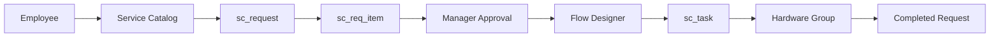

# System Architecture

```mermaid
flowchart LR
    U[Employee] --> SC[Service Catalog]
    SC --> R[sc_request]
    R --> RI[sc_req_item]
    RI --> A[Manager Approval]
    A --> FD[Flow Designer]
    FD --> T[sc_task]
    T --> H[Hardware Group]
    H --> C[Completed Request]
```

## Main Components
- Service Catalog Item
- Catalog Variables
- Requested Item
- Approval
- Flow Designer
- Catalog Task
- Hardware Assignment Group
